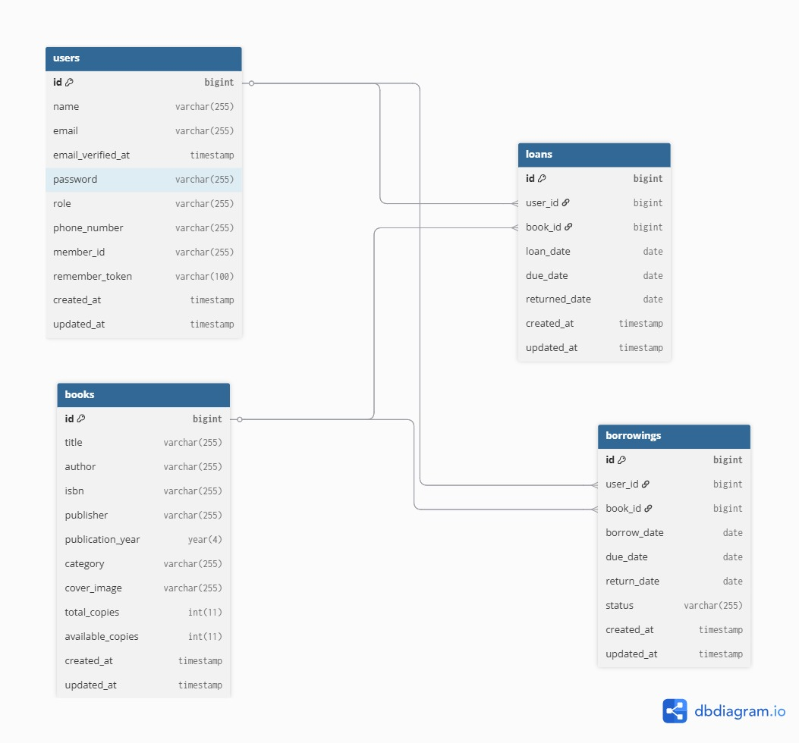

SISTEM PEMINJAMAN BUKU PERPUSTAKAAN 
Jadi, Sistem peminjaman Buku Perpustakaan yaitu sebuah aplikasi berbasis web yang dimana dirancang untuk mempermudah proses peminjaman buku di perpustakaan secara online. Pengguna dapat mencari buku, melakukan reservasi, dan melacak status peminjaman mereka tanpa perlu datang langsung ke perpustakaan hanya untuk mengecek ketersediaan buku.

Adapun latar belakang permasalahan kenapa saya memilih Sistem Peminjaman Buku di Perpustakaan karena masih banyak perpustakaan, baik di sekolah, kampus, maupun institusi lain, yang menggunakan sistem manual atau semi-digital dalam pengelolaan data peminjaman buku. Umumnya pencatatan masih dilakukan menggunakan buku tulis, file Excel, atau sistem sederhana tanpa fitur pelacakan otomatis.
Hal ini sering menimbulkan beberapa masalah, di antaranya:
1. Pengguna harus datang langsung ke perpustakaan untuk mengecek ketersediaan buku, yang memakan waktu dan tidak efisien.
2. Tidak adanya sistem antrian atau reservasi, sehingga pengguna sering berebut buku yang sama.
3. Kurangnya transparansi terhadap status buku (dipinjam, tersedia, atau sedang dipesan).
4. Kesulitan dalam pelaporan data peminjaman atau riwayat pengguna, karena data tidak tersimpan terstruktur di database.
5. Tidak ada fitur notifikasi atau pengingat saat buku hampir jatuh tempo pengembaliannya.
Dengan mengembangkan sistem reservasi buku yang terintegrasi dan berbasis web, diharapkan seluruh proses seperti pencarian, reservasi, peminjaman, hingga pengembalian buku dapat dilakukan lebih cepat, efisien, dan transparan. Sistem ini juga mendukung pengelolaan perpustakaan yang lebih profesional, serta memberikan kemudahan bagi pengguna dan petugas perpustakaan.

Tujuan dari pembangunan Sistem Peminjaman Buku Perpustakaan ini yaitu untuk menciptakan sebuah aplikasi yang dapat membantu proses peminjaman buku di perpustakaan menjadi lebih efisien, terstruktur, dan mudah diakses oleh pengguna. 

Pengguna Utama Sistem
1. Admin Perpustakaan
Admin adalah petugas yang mengelola seluruh fungsi dan data dalam sistem. Tugas dan akses admin meliputi:
- Mengelola data buku (menambah, mengedit, dan menghapus buku).
- Mengatur kategori buku.
- Melihat dan memproses permintaan reservasi dari user.
- Mencatat proses peminjaman dan pengembalian buku.
- Mengatur jumlah stok buku secara otomatis saat peminjaman/pengembalian.
- Melihat histori peminjaman seluruh user.

2. User (Anggota Perpustaan)
User adalah anggota perpustakaan, seperti siswa, mahasiswa, guru, atau karyawan yang ingin meminjam buku. Akses dan fitur yang tersedia untuk user antara lain:
- Login ke sistem untuk mengakses layanan reservasi.
- Melihat daftar buku yang tersedia beserta detailnya.
- Mencari dan memfilter buku berdasarkan judul, penulis, atau kategori.
- Melakukan reservasi buku secara online.
- Melihat status reservasi (disetujui, ditolak, atau menunggu).
- Melihat riwayat peminjaman buku yang pernah dilakukan.

Kebutuhan Fungsional
Berikut adalah daftar fitur utama (fungsi) yang wajib tersedia dalam sistem:
1. Autentikasi pengguna (login & logout) dengan dua role: Admin dan User.
2. CRUD Data Buku: Admin dapat menambahkan, mengedit, dan menghapus buku.
3. CRUD Kategori Buku: Admin dapat mengelola kategori.
4. Reservasi Buku oleh User: User dapat memesan buku secara online.
5. Persetujuan Reservasi oleh Admin: Admin dapat menerima atau menolak permintaan reservasi.
6. Pencatatan Peminjaman Buku: Setelah disetujui, buku dicatat sebagai dipinjam.
7. Pengembalian Buku: Admin mencatat saat user mengembalikan buku.
8. Manajemen Stok Otomatis: Jumlah stok buku otomatis berkurang saat dipinjam dan bertambah saat dikembalikan.
9. Pencarian dan Filter Buku: User dapat mencari berdasarkan judul, penulis, atau kategori.
10. Riwayat Peminjaman dan Reservasi: Tersedia untuk user dan admin.
11. Dashboard Statistik: Menampilkan jumlah buku, pinjaman aktif, dll.

Kebutuhan Non-fungsional
1. Keamanan Sistem: Sistem harus menerapkan otentikasi (login), enkripsi password, dan pembatasan akses berbasis role (admin/user) untuk menjaga keamanan data pengguna.
2. Performa Cepat: Sistem harus responsif dengan waktu loading maksimal 2–3 detik saat menampilkan daftar buku atau memproses reservasi, menggunakan pagination dan query efisien.
3. Kemudahan Penggunaan (Usability): Tampilan antarmuka harus user-friendly, mudah dipahami, dan konsisten. Pengguna dapat mengakses fitur reservasi dan riwayat dengan navigasi yang jelas.
4. Pengelolaan Data Terstruktur: Seluruh data peminjaman, pengembalian, dan reservasi tersimpan di database relasional dengan struktur terorganisir dan dapat diakses kembali dengan cepat.
5. Pemeliharaan dan Pengembangan: Sistem dibangun dengan struktur Laravel MVC yang memudahkan pengembangan dan pemeliharaan di masa mendatang oleh tim lain.

